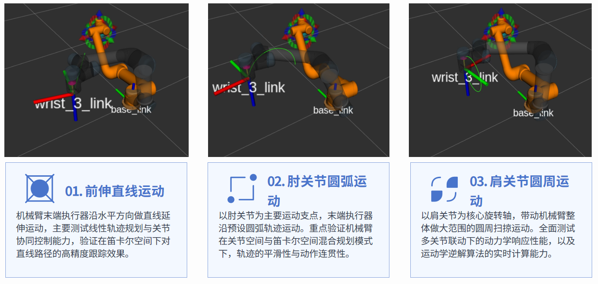

# UR5 Rehab Workspace

> ROS Noetic + Gazebo 的 UR5 康复训练与导纳控制仿真工作空间。

本项目面向课程/课题验收，支持以下核心任务：

- UR5 正运动学与逆运动学实现与精度验证
- 三种上肢康复轨迹规划与跟踪控制
- 末端六维力传感器仿真配置与验证
- 基础导纳控制与两种主动康复柔顺模式验证



---

## 目录

- [项目概览](#项目概览)
- [环境要求](#环境要求)
- [快速开始](#快速开始)
- [验收流程](#验收流程)
  - [3.2.2 正逆运动学](#322-正逆运动学)
  - [3.2.3 康复轨迹规划与跟踪](#323-康复轨迹规划与跟踪)
  - [4.2.1 六维力传感器](#421-六维力传感器)
  - [4.2.2 基础导纳控制](#422-基础导纳控制)
  - [4.2.3 两种主动康复模式](#423-两种主动康复模式)
- [可视化与量化](#可视化与量化)
- [最小复现实验顺序](#最小复现实验顺序)
- [常见问题](#常见问题)

---

## 项目概览

工作空间关键包：

- `ur5_gazebo`：UR5 康复轨迹、IK/FK、力相关节点
- `ur5_gazebo_advance`：导纳控制、主动康复模式、评估与可视化
- `universal_robot/ur_gazebo`：UR 官方 Gazebo 仿真基础

---

## 环境要求

- Ubuntu 20.04
- ROS Noetic
- Gazebo 11（Noetic 默认）

---

## 快速开始

### 1) 编译

```bash
cd ~/ur5_rehab_ws
catkin_make
source devel/setup.bash
```

### 2) 终端初始化（每个新终端）

```bash
cd ~/ur5_rehab_ws
source devel/setup.bash
```

---

## 验收流程

## 3.2.2 正逆运动学

### A. 正运动学精度验证（自定义 FK vs MoveIt FK）

终端 A（Gazebo + 控制器）：

```bash
roslaunch ur_gazebo ur5_bringup.launch \
  transmission_hw_interface:=hardware_interface/PositionJointInterface \
  controller_config_file:=$(rospack find ur5_gazebo)/config/ur5_controllers.yaml \
  controllers:="joint_state_controller ur5_arm_controller"
```

终端 B（MoveIt）：

```bash
roslaunch ur5_moveit_config moveit_planning_execution.launch sim:=true
```

终端 C（自定义 FK）：

```bash
rosrun ur5_gazebo ur5_forward_kinematics.py
```

终端 D（MoveIt FK）：

```bash
rosrun ur5_gazebo ur5_moveit_fk.py
```

终端 E（误差计算）：

```bash
rosrun ur5_gazebo fk_error_calculator.py
```

验收指标：

- 位置误差 <= 1 mm
- 姿态误差 <= 0.5 deg

### B. 逆运动学精度验证（牛顿-拉夫逊）

终端 F（IK 求解）：

```bash
rosrun ur5_gazebo ur5_ik_solver.py _target_topic:=/ur5/end_effector_pose
```

终端 G（IK 误差验证）：

```bash
rosrun ur5_gazebo ur5_ik_verifier.py _match_tolerance:=0.05
```

验收指标：

- 角度误差 <= 0.1 deg
- 无奇异位形导致的报错/崩溃

---

## 3.2.3 康复轨迹规划与跟踪

三种轨迹一键运行：

```bash
roslaunch ur5_gazebo ur5_gazebo.launch trajectory_mode:=all loop:=false sample_dt:=0.01
```

单独运行：

```bash
roslaunch ur5_gazebo ur5_gazebo.launch trajectory_mode:=line
roslaunch ur5_gazebo ur5_gazebo.launch trajectory_mode:=arc
roslaunch ur5_gazebo ur5_gazebo.launch trajectory_mode:=circle
```

轨迹对应：

- `line`：前伸直线（5s）
- `arc`：肘关节屈伸圆弧（6s）
- `circle`：肩关节环转画圆（8s）

---

## 4.2.1 六维力传感器

URDF 插件位置：

- `src/universal_robot/ur_gazebo/urdf/ur_macro.xacro`

关键配置：

- `updateRate = 1000`
- `topic = /ur5/ft_sensor/wrench`
- `plugin = libgazebo_ros_ft_sensor.so`

验证命令：

```bash
rostopic hz /ur5/ft_sensor/wrench
rostopic echo -n 5 /ur5/ft_sensor/wrench
```

验收关注：

- Gazebo 拖动末端施力后，方向与幅值匹配（目标误差 <= 0.5 N）

---

## 4.2.2 基础导纳控制

启动导纳控制：

```bash
roslaunch ur5_gazebo_advance ur5_admittance_control.launch \
  control_rate_hz:=100.0 \
  force_lpf_cutoff_hz:=10.0 \
  md_diag:='[1.0, 1.0, 1.0]' \
  bd_diag:='[50.0, 50.0, 50.0]' \
  kd_diag:='[200.0, 200.0, 200.0]'
```

稳定性验证（直线轨迹）：

```bash
roslaunch ur5_gazebo_advance ur5_rehab_stability_validation.launch
```

日志关键字：

- `UR5 end-effector tracking mean error`
- `UR5 end-effector tracking max  error`

验收指标：

- 无外力时稳定无震荡
- 平均误差 <= 3 mm

---

## 4.2.3 两种主动康复模式

### 模式 1：零力跟随

```bash
roslaunch ur5_gazebo_advance ur5_active_rehab_mode1.launch \
  start_pulse_wrench:=true \
  start_force_rviz:=true \
  wrench_waveform:=sine \
  wrench_axis:=x \
  wrench_amplitude:=1.0 \
  wrench_frequency:=0.5
```

验收指标：

- 跟随无明显滞后/卡顿
- 撤力后稳定
- 灵敏度 >= 0.5 cm/N

### 模式 2：柔顺轨迹跟踪

```bash
roslaunch ur5_gazebo_advance ur5_active_rehab_mode2.launch \
  start_pulse_wrench:=true \
  start_force_rviz:=true \
  wrench_pattern:=mode2_cycle \
  wrench_amplitude:=8.0 \
  wrench_on_duration:=2.0 \
  wrench_interval_duration:=2.0
```

验收指标：

- 无外力时稳定跟踪圆轨迹
- 受外力时平滑修正，无硬冲击
- 无外力阶段平均误差 <= 5 mm

---

## 可视化与量化

启动工具：

```bash
rviz
rqt_plot
```

常用曲线：

```bash
rqt_plot /ur5/ft_sensor/wrench/wrench/force/x /ur5/ft_sensor/wrench_corrected/wrench/force/x
rqt_plot /ur5/admittance/debug/raw_force_norm /ur5/admittance/debug/filtered_force_norm
rqt_plot /ur5/admittance/debug/delta_pos_norm
```

离线绘图脚本：

```bash
rosrun ur5_gazebo_advance ur5_plot_active_rehab_bag.py --help
```

---

## 最小复现实验顺序

1. 三轨迹

```bash
roslaunch ur5_gazebo ur5_gazebo.launch trajectory_mode:=all
```

2. 稳定性验证

```bash
roslaunch ur5_gazebo_advance ur5_rehab_stability_validation.launch
```

3. 基础导纳

```bash
roslaunch ur5_gazebo_advance ur5_admittance_control.launch
```

4. 主动模式 1

```bash
roslaunch ur5_gazebo_advance ur5_active_rehab_mode1.launch start_pulse_wrench:=true
```

5. 主动模式 2

```bash
roslaunch ur5_gazebo_advance ur5_active_rehab_mode2.launch
```

---

## 常见问题

1. 启动后机械臂不动

- 检查是否已 `source devel/setup.bash`
- 检查命令话题是否发布：

```bash
rostopic hz /ur5_arm_controller/command
```

2. 跟踪误差偏大

- 避免把机械臂起始抬臂阶段计入统计
- 优先用稳定性验证 launch 的默认评估门限

3. 导纳对外力无响应

```bash
rostopic echo -n 1 /ur5/ft_sensor/wrench_corrected
rostopic echo -n 1 /ur5/ft_sensor/command_wrench
```
