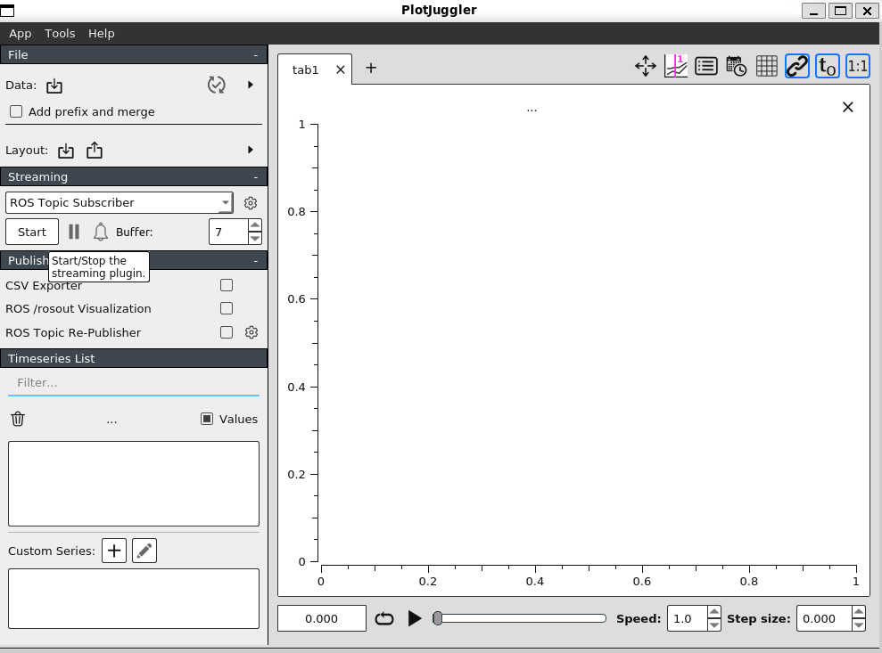
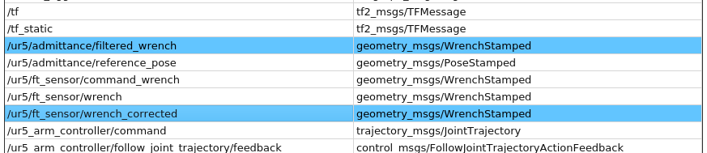
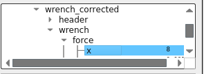

# 欢迎来到我们的ArmAssistArm代码仓库！

---

首先，先来介绍一下我们的代码包：打开工作空间后，你会看到6个ROS包：
- ros_control
- ros_controllers
- universal_robot
- ur5_gazebo
- ur5_gazebo_advance
- ur5_kinematics

我们的工作主要存放在后3个包：
- ur5_gazebo
（python包【编写者：贾东睿（正逆解节点、基础任务的python实现、传感器安装）】）
- ur5_gazebo_advance
（python包【编写者：贾东睿（导纳控制实现）/周昭宏（两种康复模式实现）】）
- ur5_kinematics
（cpp包【编写者：罗斯民（正逆解节点、基础任务的cpp实现）】）

因此，我们组同时完成了基础任务的python实现和cpp实现，但是由【贾东睿】负责的基础部分主要服务于后续的导纳控制，但是精度要求均满足（可视化有所欠缺），由【罗斯民】负责的cpp版本的基础任务的实现则专门服务于基础部分的考核，可视化较好。

---

接下来，我们会针对测试的指标给出相应的命令行：

## 注意：如果出现文件权限不足，请先在工作空间编译！

- 如果你想查看基础任务的python实现，请运行：
```bash
roslaunch ur5_gazebo ur5_gazebo.launch
```
> 机械臂的位姿切换需要时间，请耐心等待；运动位姿精度可以从bash中查看滚动消息

- 如果你想查看附加任务中的恒力模式，且想要查看六维传感器的测量精度，请运行：
```bash

```
如果你想更清楚的观测数据，请安装：
```bash
sudo apt update
sudo apt install ros-noetic-plotjuggler-ros
```
然后操作如下：
首先点击页面中的“start”

选中这两项：

在这个窗口中把想要观测的数据拖动到右侧大窗口


- 如果你想查看我们的导纳控制在正弦力下的表现，请运行：
```bash
 roslaunch ur5_gazebo_advance ur5_admittance_control.launch
```
如果你想查看详细的数据，方法同上。

- 如果你想查看导纳控制在0力模式下的直线跟踪，请运行：
```bash
 roslaunch ur5_gazebo_advance ur5_rehab_stability_validation.launch

```
> 命令行窗口会在机械臂停止时，打印轨迹的跟踪误差